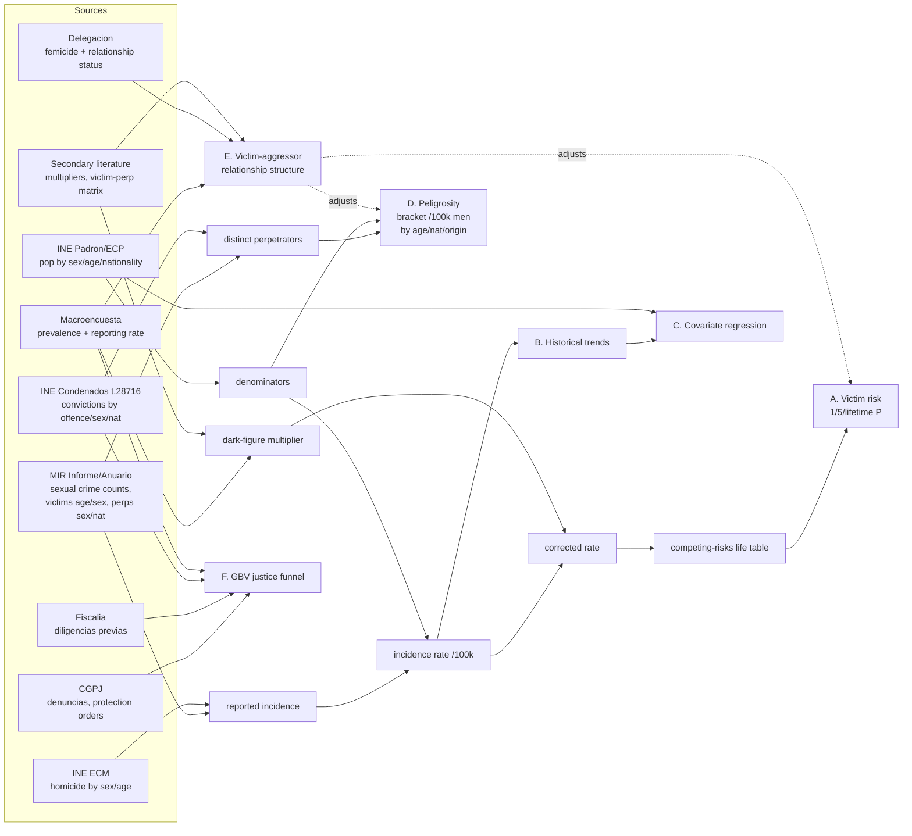

# Plan: Define key quantities/insights, extraction→composition map, and roadmap for SVS

## Context

The user wants the project to (a) state precisely *what quantities/insights we are
aiming for*, (b) spell out *which information to extract from each report and how it
composes into the more elaborate metrics*, and (c) sequence it step by step — with a
**mermaid composition diagram in README**, and later a diagram in the dashboard.

This round also adds four new target quantities the user requested:

1. **Peligrosity** — per-capita probability that a man (overall or by age / nationality /
   origin / later socioeconomic) is a *sexual aggressor*. Reported as a **bracket**:
   lower = convicted (INE Condenados), upper = identified (MIR detenidos+investigados),
   per 100k men. Headline insight: *even where a subgroup's relative rate is higher, the
   absolute per-individual probability stays very low* — this is exactly V14's logic
   applied to the perpetrator side. **Peligrosity is the umbrella metric**; the existing
   migrant crime-rate track (T26–T29) becomes its *nationality slice*. Later extends to
   "other petty crimes."
2. **Victim–aggressor relationship structure** — for all sexual assault (with/without
   penetration), the distribution of perpetrator relationship (partner / known / stranger)
   and the victim↔aggressor matrix; used to **adjust** both the victim risk profile and
   peligrosity.
3. **GBV non-sexual justice funnel** (*later expansion*) — broaden gender-based violence
   from femicidios to the full funnel: reported denuncias → prosecution (diligencias) →
   conviction (condenas) + estimated reporting rate, for physical & psychological GBV.
4. **Literature-first sourcing** — lean on already-published studies/syntheses, but trace
   and document each one's primary source rather than citing the synthesis blindly.

Status of the underlying spec is otherwise healthy (caveman/SDD: §G/§C/§I/§V/§T/§B; 29
tasks + T-mig-tab; 14 invariants; 7-bug log). Two drift items found in review:

- Commit `55cfa64` fully built the migration dashboard tab (6 charts G1–G6, matching
  T-mig-tab's described scope) but did **not** update SPEC.md — T-mig-tab still shows `.`.
- **README.md** is stale ("Early stage, data collection in progress") despite a live
  3-tab dashboard and ~9 done tasks.

Earlier user decision this session: **prioritize the core probability pipeline (Phases
1–2)**. The new perpetrator-side work (peligrosity, relationship) slots into Phase 3
alongside the migrant track; the GBV funnel is an explicit *later* phase.

The data inventory (Explore pass) confirms raw material exists for nearly all of this —
the main gaps are unparsed: INE Condenados table 28716 (convictions by offence/sex/
nationality), MIR perpetrator-nationality PDFs 2019–2024 (downloaded, not parsed), and a
current victim–perpetrator matrix (only MIR 2010–2012 located). These become tasks, not
blockers.

---

## Target quantities — final structure (groups A–F)

Recorded in §G (change #1) and turned into a literal checklist in `reports/results.md`
(change #2):

- **A. Victim risk profile** — for rape / sexual-assault / femicide / other-homicide /
  non-sexual-violence + combined "any violence": incidence/100k (2025) → 1yr/5yr/lifetime
  cumulative P, both **reported** and **dark-figure-corrected** (T8, T9).
- **B. Historical trends** 2000–2025 with definition-break annotations (largely in the
  dashboard already).
- **C. Covariate effects** (associative) — violence-rate ~ far-right vote-share +
  immigration volume/composition; ±10/20% scenario table (T10, T12, T13).
- **D. Peligrosity (umbrella)** — per-capita perpetrator rate, **bracket
  [convicted ↔ identified] per 100k men**, by age × nationality × origin (later
  socioeconomic). Always paired with absolute framing per V14. The migrant/nationality
  slice = T26–T29; new general engine = T30/T31.
- **E. Victim–aggressor relationship structure** — relationship distribution + victim↔
  aggressor matrix (sexual assault, ±penetration); produces adjustment factors that feed
  back into A and D (T32, T33).
- **F. GBV non-sexual justice funnel** (*later expansion*) — denuncias → diligencias →
  condenas + reporting rate, for physical/psychological GBV (T34).

---

## The extraction → composition map (heart of the request)

Detailed per-source extraction table + composition DAG live in **`reports/methodology.md`**
(folded into T15, per user). A condensed mermaid version goes in **README**. Both encode
the same dependency graph:

The methodology.md per-source table has columns:
`Source doc | quantities to extract (exact tables/fields) | confidence | feeds metric(s) | task`.
One row per source in the inventory (MIR Informe/Anuario, INE Condenados t.28716, INE
Padrón/ECP, INE ECM t.7947, Delegación ficha, CGPJ, Fiscalía Memorias, Macroencuesta
2015/2019/2024, the 4 reference PDFs, fuentes_secundarias 29-source catalogue).

---

## Changes

### 1. SPEC.md — amend §G: append "Key Quantities & Insights" (groups A–F)

Keep the existing §G paragraph as the headline. Append a caveman subsection enumerating
groups A–F above, each tagged with producing §T tasks, pointing to `reports/results.md`
(template) and `reports/methodology.md` (extraction map). Note explicitly that **D
subsumes the old migrant-crime track** and that **E adjusts A & D**.

### 2. Create `reports/results.md` — target-output skeleton (checklist)

New file (dir doesn't exist yet; eventual T16 deliverable, seeded now). One subsection per
group A–F. Table columns:
`Metric | Scope (type / demographic slice) | Value | CI | Basis (reported / dark-fig / lower-upper) | Source task | Status`.

- **A**: full grid pre-populated — 5 violence types + combined × {incidence, 1yr, 5yr,
  lifetime} × {reported, dark-fig-corrected}, all `pending` (T8/T9).
- **D (peligrosity)**: rows for overall + by age + by nationality + by origin, each as a
  `lower–upper` bracket, all `pending` (T30/T31; nationality slice T26–T28).
- **E**: relationship-distribution + adjustment-factor rows, `pending` (T32/T33).
- **B**: points at live dashboard tabs. **C**: `pending` (T10/T12/T13). **F**: `pending`
  (T34), flagged *later expansion*.

### 3. SPEC.md — amend §C and §V: new constraints + invariants

Append (monotonic numbering, per spec SKILL rules):

- **C15** (literature-first): published studies/syntheses ! preferred where they exist,
  but ∀ secondary figure → primary source ! traced & documented; secondary value ⊥ cited
  as if primary. (extends C1; the 29-source catalogue in
  `fuentes_secundarias_analisis_espana.md` is the working set.)
- **V15** (peligrosity shape): peligrosity ! reported as bracket
  [lower = convicted (INE Condenados), upper = identified (detenidos+investigados)] per
  100k men of the slice; numerator = distinct persons (deduped), ⊥ crime-event counts
  (avoids one-perp-many-crimes inflation); denominator = male population of that slice
  (Padrón/ECP); subject to V14 relative/absolute pairing.
- **V16** (victim ≠ aggressor counts): any conversion between victimization rate and
  peligrosity ! account for one-aggressor→multiple-victims and repeat victimization via
  the §E relationship distribution; adjustment factor + source ! documented.
- **V17** (funnel source hygiene): GBV justice-funnel rates ! keep administrative sources
  distinct — MIR police denuncias ≠ CGPJ judicial ≠ Fiscalía diligencias ≠ INE condenas;
  counts ⊥ divided across incompatible sources without a documented bridge.

### 4. SPEC.md — amend §T: phased roadmap + new tasks T30–T36 + drift fix

Insert a narrative **Roadmap** block under the `## §T` header (before the pipe table,
which stays structurally intact for build/check tooling):

- **Phase 0 — housekeeping/now**: sync T11/T-mig-tab status; rewrite README + mermaid
  (change #5); create `reports/results.md` (change #2); expand §G/§C/§V (changes #1, #3).
- **Phase 1 — finish core violence series** (unblocks life table): T2, T21, T22, T4, T5,
  T14, **T35** (literature synthesis → dark-figure & relationship priors).
- **Phase 2 — core probability deliverable** *(current priority)*: T8, T9, T24, **T15**
  (now incl. extraction map + composition DAG), T16.
- **Phase 3 — peligrosity & relationship**: **T30, T31** (peligrosity engine + bracket),
  **T32, T33** (relationship structure + adjustment); nationality slice = T26, T27, T28,
  T29.
- **Phase 4 — covariate regression & projections**: T10, T12, T13.
- **Phase 5 — later expansions**: **T34** (GBV non-sexual funnel), **T36** (docs
  composition/methodology diagram), peligrosity for other petty crimes.

New §T rows (append; ids monotonic after T29/T-mig-tab):

- **T30** `.` Extract distinct-perpetrator counts (sexual) — MIR Informe detenidos+
  investigados 2019–2024 (deduped where possible) + INE Condenados table 28716 by
  offence/sex/age/nationality → `data/raw/perpetrators_sexual.csv` (numerator for
  peligrosity bracket; generalizes T26). cites C1,C13,V1,V12,V14,V15
- **T31** `.` Compute peligrosity → `src/compute_peligrosity.py`: distinct perps ÷ male
  population (Padrón/ECP) → bracket [convicted, identified] per 100k men, by age ×
  nationality × origin, with CIs → `data/processed/peligrosity_rates.csv`; nationality
  slice ! reconcile with `migrant_crime_rates.csv` (T28). cites V6,V14,V15,C10
- **T32** `.` Extract victim–aggressor relationship structure — Macroencuesta
  (partner / known / stranger; ±penetration), MIR victim-perp matrix (2010–2012 + any
  newer), Delegación `relationship_status` → `data/processed/relationship_structure.csv` +
  victims-per-aggressor & repeat-victimization factors. cites C5,V16
- **T33** `.` Apply relationship adjustment — adjust §A victim risk & §D peligrosity using
  T32 factors; document each adjustment + source. cites V16,V9
- **T34** `.` *(later)* GBV non-sexual justice funnel — extract denuncias (CGPJ/MIR),
  diligencias (Fiscalía Memorias), condenas (INE Condenados/CGPJ), protection orders;
  compute reporting rate (vs Macroencuesta physical/psychological prevalence), prosecution
  rate, conviction rate → `data/raw/gbv_funnel.csv` + `data/processed/gbv_funnel_rates.csv`.
  cites C5,V11,V17
- **T35** `.` Literature-evidence synthesis — from `fuentes_secundarias_analisis_espana.md`
  (29 sources) + 4 reference PDFs, extract each study's headline metrics + trace to primary
  source → `data/sources/literature_evidence.md` table; supplies dark-figure multipliers,
  victim-perp matrices, relationship priors as cross-checks. cites C1,C15,V11
- **T36** `.` *(later)* Add composition/methodology diagram to `docs/index.html` (dashboard
  rendering of the extraction→metric DAG). cites I.*

Drift fix in the table:
- **T-mig-tab**: `.` → `x`; note delivery via `src/build_migration_dashboard_data.py`
  (commit `55cfa64`) on the T17/T23 tabbed architecture — charts G1 (inflow + 2008 break),
  G2 (origin composition), G3 (sex split), G4/G5 (age composition/profile), G6 (stock).
- **T11**: stays `~` (its own data-gap items remain open), trim note now that dashboard
  rendering is done.

Also amend **T15** description to add: per-source extraction table + composition DAG
(mermaid) + peligrosity/relationship/funnel definitions.

### 5. README.md — rewrite to current state + mermaid composition diagram

- Keep the **core question** paragraph; **extend the Scope table** with the perpetrator-
  side (peligrosity) and relationship rows; keep it accurate.
- Replace stale "Data sources / Methodology / Repo layout (planned/evolving)" + "Status"
  with: (a) a **"What we're computing"** list (groups A–F, one line each); (b) the
  **condensed mermaid composition diagram**; (c) a **"Where to look"** pointer list
  (SPEC.md, `reports/results.md`, `reports/methodology.md`, `data/sources/SOURCES_INDEX.md`,
  `docs/index.html`); (d) an accurate **Status** line (3-tab dashboard live; Phase 1–2
  current focus; perpetrator-side = Phase 3).

---

## Out of scope (flagged, not actioned this round)

- Residual un-archived files in `data/haiku_artifacts/` and tracked scratch file
  `tmp_svs_explore/migration_const.js` (commit `55cfa64`) — future cleanup pass.
- Actually parsing the PDFs / building the new compute scripts — those are the *tasks*
  (T30–T35) this plan defines, executed in later phases. This round writes specs/docs only.

---

## Verification

Docs-only change — no code execution. Verify by:
- Re-read edited SPEC.md: §T pipe table still parses (same column count, no broken rows);
  section headers §G/§C/§I/§V/§T/§B unchanged; new V15–V17, C15, T30–T36 numbered
  monotonically with no reuse; every new §T row has a `cites` column.
- `reports/results.md` and `reports/methodology.md` render cleanly; every group-A/D/E row
  names a source task that exists in §T.
- README mermaid block renders (valid flowchart syntax) and the source→metric edges match
  the methodology.md DAG.
- Skim README scope/status for consistency with SPEC's actual task statuses.
