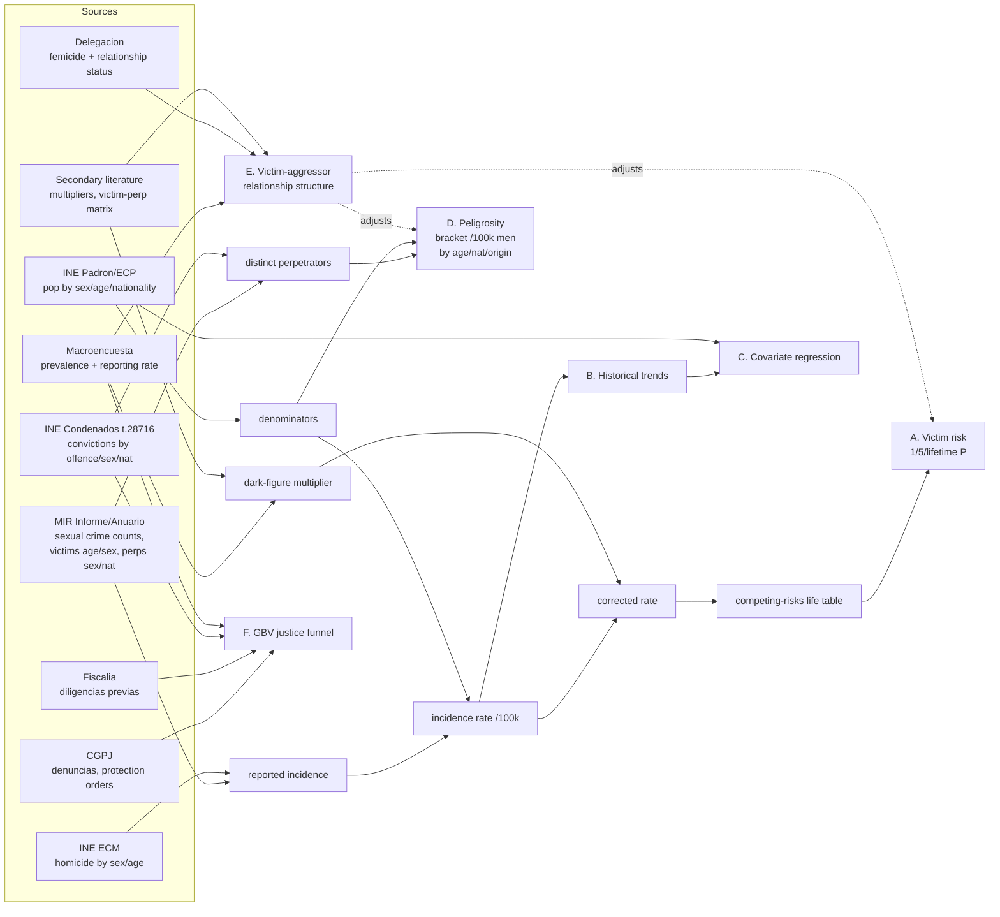

# SVS — Sexual Violence in Spain

**Core question:** Given a woman born in 2000, living in Spain in 2025 — what is her probability of being raped, sexually assaulted, femicided, murdered, or suffering non-sexual violence in the next year, next 5 years, and over her remaining lifetime? Calculated assuming 2025 conditions persist.

**Follow-up:** Using historical data (2000–2025), how do those probabilities shift under changes in explanatory variables — e.g. far-right vote share, total immigration volume, or immigration broken down by origin, gender, and age cohort?

---

## Scope

| Violence type | Definition used |
|---|---|
| Rape / sexual assault | Crimes recorded under CP arts. 178–184 + victimisation surveys |
| Femicide | Intimate-partner and family homicides of women (official CGPJ/Ministerio registry) |
| Homicide (other) | All other female homicide victims |
| Non-sexual violence | Physical assaults recorded against women (domestic + non-domestic) |
| Peligrosity | Per-capita perpetrator rate, bracket [convicted ↔ identified] per 100k men, by age × nationality × origin |
| Victim–Aggressor | Relationship distribution + victim↔aggressor matrix for sexual assault |

## What we're computing

- **A. Victim risk profile:** 1yr/5yr/lifetime cumulative P for various violence types, reported and dark-figure-corrected.
- **B. Historical trends:** 2000–2025 annual trends with definition-break annotations.
- **C. Covariate effects:** Associative analysis of violence-rate ~ political & immigration variables.
- **D. Peligrosity (umbrella):** Per-capita perpetrator rate, bracket [convicted ↔ identified] per 100k men, by age × nationality × origin.
- **E. Victim–aggressor relationship structure:** Relationship distribution + victim↔aggressor matrix for sexual assault, used to adjust A & D.
- **F. GBV non-sexual justice funnel:** Denuncias → diligencias → condenas + reporting rate (later expansion).

## Data Extraction and Composition

## Where to look

- `SPEC.md`: Detailed specification, invariants, and task roadmap.
- `reports/results.md`: Checklist of target quantities and their current status.
- `reports/methodology.md`: Detailed per-source extraction table and composition DAG.
- `data/sources/SOURCES_INDEX.md`: One-page index over living source documents.
- `data/PIPELINE.md`: Script-level data pipeline map — every script's reads/writes + `§T` task, distinct from the goal-level DAG above.
- `docs/index.html`: Interactive dashboard with rich visualizations.

## Status

3-tab dashboard live; Phase 1–2 (core probability pipeline) current focus; perpetrator-side (Peligrosity) = Phase 3.
