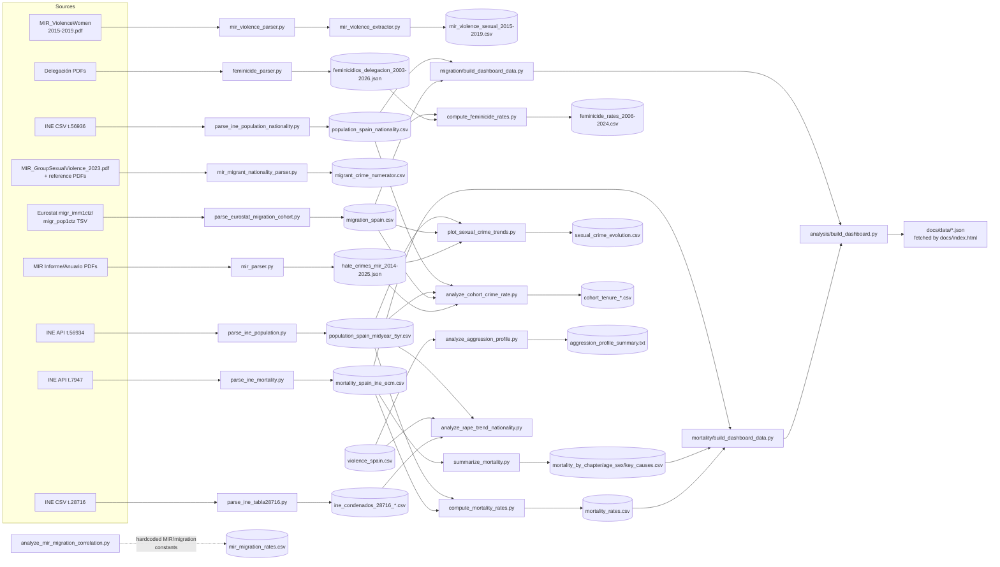

# Data Pipeline Map

Script-level companion to the goal-level DAG in [`README.md`](../README.md) (which
maps *target quantities* A-G to source categories). This doc maps *scripts* to
*files* — every script under `src/` and `src/parsers/`, what it reads, what it
writes, and which `§T` task it belongs to. Any script missing from the table
below, or any row with an empty `§T task` column, is an orphan by construction
(V33).

Status column mirrors `§T`'s own vocabulary: `x` = done/working, `~` =
partial/in-progress, `.` = not yet functional for its stated purpose.

## Parsers (`src/parsers/`)

Most share `src/parsers/utils.py` (`extract_text`, `write_csv_rows`,
`parse_es_number`, `cli_require_arg` — see T53); `feminicide_parser.py` only
uses `extract_text` (it writes JSON via Pydantic, not CSV, so the
CSV-writing/argv-guard helpers don't apply).

| script | reads | writes | §T task | status |
|---|---|---|---|---|
| `feminicide_parser.py` | Delegación del Gobierno feminicide PDFs, 2003-2026 (single file or `--pdf-dir`), via `pdftotext` | `data/raw/feminicidios_delegacion_{min_year}-{max_year}.json` | T19,T20 | x |
| `mir_parser.py` | MIR Informe (2017-2024, nationality data; total_count only 2019+) + Anuario (2000-2021) PDFs, via `pdfplumber` | `data/raw/sexual_crimes_mir_{min_year}-{max_year}.json` | T21,T22 | ~ |
| `mir_violence_parser.py` | `MIR_ViolenceWomen_2015-2019.pdf` (pages 52-57 by default) | stdout summary only — parsing-logic module, no file output of its own | T32 (input, untapped) | . |
| `mir_violence_extractor.py` | same PDF, via `mir_violence_parser.parse_pdf()` | `data/raw/mir_violence_sexual_2015-2019.csv` | T32 (input, untapped) | . |
| `mir_migrant_nationality_parser.py` | `MIR_GroupSexualViolence_2023.pdf` + `data/sources/` reference PDFs | `data/raw/migrant_crime_numerator.csv` | T27 | ~ |

Both `mir_violence_parser.py`/`mir_violence_extractor.py` currently extract
**0 rows** against the default page range — a pre-existing (not caused by
this cleanup) `pdftotext`/report-layout mismatch, see §B.

## Analysis (`src/<domain>/`)

`src/` was reorganized into per-domain module directories (`feminicides/`,
`sexual_crimes/`, `crime/`, `migration/`, `mortality/`, `analysis/`); `git mv`
preserved history. `src/parsers/` and `src/download_reference_documents.sh`
were left untouched at the paths above.

| script | reads | writes | §T task | status |
|---|---|---|---|---|
| `src/analysis/parse_ine_population.py` | INE API table 56934 (population estimates) | `data/processed/population_spain_estimates.csv`, `data/processed/population_spain_midyear_5yr.csv` | T6 | x |
| `src/analysis/parse_ine_population_nationality.py` | INE table 56936 CSV (population by date/sex/age/nationality) | `data/processed/population_spain_nationality.csv` | T89 | x |
| `src/mortality/parse_ine_mortality.py` | INE API table 7947 JSON dump (input/output paths via argv) | CSV named via argv → `data/processed/mortality_spain_ine_ecm.csv` | T49 | x |
| `src/mortality/summarize_mortality.py` | `mortality_spain_ine_ecm.csv` | `data/processed/mortality_by_chapter.csv`, `mortality_by_age_sex.csv`, `mortality_key_causes.csv` | T49 | x |
| `src/mortality/compute_mortality_rates.py` | `mortality_spain_ine_ecm.csv`, `population_spain_midyear_5yr.csv` | `data/processed/mortality_rates.csv`, `mortality_rates_key.csv`, `mortality_rates_all_cause_by_age.csv` | T7 | x |
| `src/feminicides/compute_feminicide_rates.py` | `feminicidios_delegacion_2003-2026.json` (2006-2024 reports, victim+perpetrator counts), `population_spain_midyear_5yr.csv` (female+male), `migration_spain.csv` (foreign-resident stock, female+male share) | `data/processed/feminicide_rates_2006-2024.csv` (per-origin × per-role, 4 rows/year) | T24,T60 | x |
| `src/crime/parse_ine_tabla28716.py` | INE table 28716 CSV, fetched live from `ine.es` | `data/processed/ine_condenados_28716_sexual_crimes.csv`, `ine_condenados_28716_nationality_pct.csv` | T26,T30 | ~ |
| `src/crime/parse_ses_odio_nationality.py` | SES portal megatablas 06019 (detenidos)/06013 (víctimas), fetched live from `estadisticasdecriminalidad.ses.mir.es`, national-level rows only | `data/raw/hate_crimes_ses_nacionalidad_{detenidos,victimas}_2021-2024.csv`, `..._summary_2021-2024.csv` | T76 | x |
| `src/migration/parse_eurostat_migration_cohort.py` | Eurostat bulk TSV `migr_imm1ctz`/`migr_pop1ctz` (manual download, not in `data/raw/`) | appends to `data/raw/migration_spain.csv` | T11,T43,T44 | ~ |
| `src/crime/analyze_cohort_crime_rate.py` | `migration_spain.csv`, `sexual_crimes_mir_2017-2024.json`, `population_spain_midyear_5yr.csv` | `data/processed/cohort_tenure_*.csv` (4 files) + 2 PNGs | T41 | x |
| `src/crime/analyze_mir_migration_correlation.py` | hardcoded MIR/migration constants (documented inline; not read from a live CSV) | `data/processed/mir_migration_rates.csv` | T50 | x |
| `src/crime/analyze_rape_trend_nationality.py` | `violence_spain.csv`, `ine_condenados_28716_sexual_crimes.csv`, `population_spain_midyear_5yr.csv` | stdout report only (no file) | T51 | x |
| `src/crime/parse_ine_tabla28857.py` | INE table 28857 CSV, fetched live from `ine.es` | `data/processed/ine_condenados_28857_age_nationality.csv` | T77 | x |
| `src/crime/compute_age_standardized_rate.py` | `ine_condenados_28857_age_nationality.csv`, `population_spain_estimates.csv`, `migration_spain.csv`, `sexual_crimes_mir_2017-2024.json` | `data/processed/age_standardized_rate_test.csv`, `age_standardized_dz_ma_ratio.csv` | T78 | x |
| `src/crime/analyze_offense_subtype_funnel_triangulation.py` | `ine_condenados_28716_sexual_crimes.csv`, `sexual_crimes_mir_2017-2024.json` | `data/processed/offense_subtype_funnel_triangulation.csv` | T79 | x |
| `src/crime/compute_victim_vulnerability_rates.py` | `sexual_crimes_mir_2017-2024.json`, `migration_spain.csv` | `data/processed/victim_vulnerability_rates.csv` | T81 | x |
| `src/crime/compute_regularization_sensitivity.py` | `regularization_2026.csv`, `migration_spain.csv`, `sexual_crimes_mir_2017-2024.json` | `data/processed/regularization_sensitivity_test.csv`, `regularization_sensitivity.png` | T85 | x |
| `src/crime/parse_anuario_general_crime.py` | `data/sources/anuario-estadistico/MIR_AnuarioEstadistico_{2016..2023}.pdf`, via `pdfplumber` (2 tables/edition, "Seguridad Ciudadana" chapter, content-located across 2 known title formats) | `data/raw/mir_anuario_general_crime_2015-2023.csv` | T84 | x |
| `src/crime/compute_general_crime_trends.py` | `mir_anuario_general_crime_2015-2023.csv`, `population_spain_midyear_5yr.csv`, `migration_spain.csv` | `data/processed/general_crime_trends.csv` | T84 | x |
| `src/analysis/analyze_aggression_profile.py` | `violence_spain.csv` | `data/processed/aggression_profile_summary.txt` | T52 | x |
| `src/sexual_crimes/plot_sexual_crime_trends.py` | `sexual_crimes_mir_2017-2024.json`, `migration_spain.csv`, `population_spain_midyear_5yr.csv` | `data/processed/sexual_crime_evolution.csv` + 3 charts | T42 | x |
| `src/mortality/build_dashboard_data.py` | `mortality_rates_key.csv`, `mortality_by_chapter.csv`, `mortality_rates.csv`, `mortality_spain_ine_ecm.csv` | `build()` consumed by `src/analysis/build_dashboard.py` → `docs/data/mortality.json`; legacy stdout-JS `main()` kept for standalone use | T17,T23 | x |
| `src/migration/build_dashboard_data.py` (formerly `build_migration_dashboard_data.py`) | `migration_spain.csv`, `population_spain_midyear_5yr.csv`, `regularization_2026.csv` | `build()` consumed by `src/analysis/build_dashboard.py` → `docs/data/migration.json` (incl. T77's `stock_age_pyramid_dz_ma`/`dz_ma_working_age_trend` keys, T86's `stock_projection_2026` key); legacy stdout-JS `main()` kept for standalone use | T-mig-tab,T77,T86 | x |
| `src/feminicides/build_dashboard_data.py` | `feminicidios_delegacion_2003-2026.json` (all years, incl. 2003-2005 stub reports), `feminicide_rates_2006-2024.csv` (full 2006-2024 series) | `build()` consumed by `src/analysis/build_dashboard.py` → `docs/data/feminicides.json` (`timeline` 2003-present w/ age-band breakdown + provisional flag, `rates` w/ `years`/`latest_year`/full `rows` series, static `milestones`; `regional`/`age_origin` removed) | T23,T24,T60,T61 | x |
| `src/sexual_crimes/build_dashboard_data.py` | `sexual_crimes_mir_2017-2024.json`, `sexual_crime_evolution.csv`, `ine_condenados_28716_sexual_crimes.csv` | `build()` consumed by `src/analysis/build_dashboard.py` → `docs/data/sexual_crimes.json` | T3,T21,T22 | x |
| `src/crime/build_dashboard_data.py` | `hate_crimes_mir_2014-2025.json`, `hate_crimes_ses_nacionalidad_{detenidos,victimas}_summary_2021-2024.csv`, `cohort_tenure_period_test.csv`, `cohort_share_test.csv`, `victim_vulnerability_rates.csv`, `regularization_sensitivity_test.csv`, `general_crime_trends.csv` | `build_hate_crimes()`/`build_cohort_tenure()`/`build_victim_vulnerability()`/`build_regularization_sensitivity()`/`build_general_crime()` consumed by `src/analysis/build_dashboard.py` → `docs/data/hate_crimes.json`, `docs/data/cohort_tenure.json`, `docs/data/victim_vulnerability.json`, `docs/data/regularization_sensitivity.json`, `docs/data/general_crime.json` | T41,T59,T76,T82,T85,T88 | x |
| `src/analysis/build_dashboard.py` | calls each domain's `build_dashboard_data.build()` (feminicides, sexual_crimes, crime, migration, mortality) via `importlib` (all 5 modules share the filename `build_dashboard_data.py`, so a plain `import` would only bind the first one loaded) | `docs/data/*.json` (9 files) | T17,T23,T-mig-tab,T82,T88 | x |

31 scripts total (5 parsers + 26 analysis), zero missing a `§T` reference.

## Script-level flow

## Not yet wired into §T

None — all 20 scripts now cite a `§T` id (see tables above). Two things
worth flagging as *still incomplete*, not orphaned:

- `mir_violence_parser.py`/`mir_violence_extractor.py` cite `T32` as an
  available input, but `T32` itself hasn't started — the extractor's real
  output (`mir_violence_sexual_2015-2019.csv`) sits unused until then.
- Analysis-script *code* consolidation (the `compute_feminicide_rates.py` /
  `compute_mortality_rates.py` count÷population pattern, and the
  `mortality/build_dashboard_data.py` / `migration/build_dashboard_data.py`
  legacy stdout-JS `main()` pattern, now superseded by `build()` +
  `analysis/build_dashboard.py` for the live dashboard) is deferred —
  tracked as backlog task T54.
