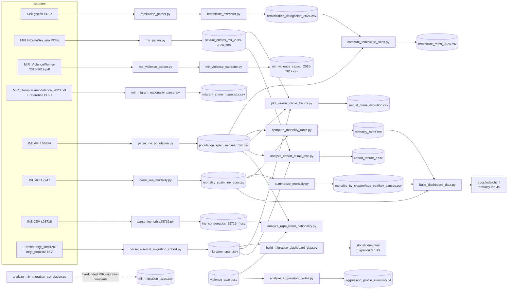

# Data Pipeline Map

Script-level companion to the goal-level DAG in [`README.md`](../README.md) (which
maps *target quantities* A-G to source categories). This doc maps *scripts* to
*files* — every script under `src/` and `src/parsers/`, what it reads, what it
writes, and which `§T` task it belongs to. Any script missing from the table
below, or any row with an empty `§T task` column, is an orphan by construction
(V33).

Status column mirrors `§T`'s own vocabulary: `x` = done/working, `~` =
partial/in-progress, `.` = not yet functional for its stated purpose.

## Parsers (`src/parsers/`)

All six share `src/parsers/utils.py` (`extract_text`, `write_csv_rows`,
`parse_es_number`, `cli_require_arg` — see T53).

| script | reads | writes | §T task | status |
|---|---|---|---|---|
| `feminicide_parser.py` | Delegación del Gobierno feminicide PDF (per year) | stdout summary only — parsing-logic module, no file output of its own | T19 | x |
| `feminicide_extractor.py` | PDF dir, via `feminicide_parser.parse_pdf()` | `data/raw/feminicidios_delegacion_2024.csv` | T20 | x |
| `mir_parser.py` | MIR Informe (2019-2024) + Anuario (2000-2021) PDFs, via `pdfplumber` | `data/raw/sexual_crimes_mir_{min_year}-{max_year}.json` | T21,T22 | ~ |
| `mir_violence_parser.py` | `MIR_ViolenceWomen_2015-2019.pdf` (pages 52-57 by default) | stdout summary only — parsing-logic module, no file output of its own | T32 (input, untapped) | . |
| `mir_violence_extractor.py` | same PDF, via `mir_violence_parser.parse_pdf()` | `data/raw/mir_violence_sexual_2015-2019.csv` | T32 (input, untapped) | . |
| `mir_migrant_nationality_parser.py` | `MIR_GroupSexualViolence_2023.pdf` + `data/sources/` reference PDFs | `data/raw/migrant_crime_numerator.csv` | T27 | ~ |

Both `mir_violence_parser.py`/`mir_violence_extractor.py` currently extract
**0 rows** against the default page range — a pre-existing (not caused by
this cleanup) `pdftotext`/report-layout mismatch, see §B.

## Analysis (`src/`)

| script | reads | writes | §T task | status |
|---|---|---|---|---|
| `parse_ine_population.py` | INE API table 56934 (population estimates) | `data/processed/population_spain_estimates.csv`, `data/processed/population_spain_midyear_5yr.csv` | T6 | x |
| `parse_ine_mortality.py` | INE API table 7947 JSON dump (input/output paths via argv) | CSV named via argv → `data/processed/mortality_spain_ine_ecm.csv` | T49 | x |
| `summarize_mortality.py` | `mortality_spain_ine_ecm.csv` | `data/processed/mortality_by_chapter.csv`, `mortality_by_age_sex.csv`, `mortality_key_causes.csv` | T49 | x |
| `compute_mortality_rates.py` | `mortality_spain_ine_ecm.csv`, `population_spain_midyear_5yr.csv` | `data/processed/mortality_rates.csv`, `mortality_rates_key.csv`, `mortality_rates_all_cause_by_age.csv` | T7 | x |
| `compute_feminicide_rates.py` | `feminicidios_delegacion_2024.csv`, `population_spain_midyear_5yr.csv` | `data/processed/feminicide_rates_2024.csv` | T24 | ~ |
| `parse_ine_tabla28716.py` | INE table 28716 CSV, fetched live from `ine.es` | `data/processed/ine_condenados_28716_sexual_crimes.csv`, `ine_condenados_28716_nationality_pct.csv` | T26,T30 | ~ |
| `parse_eurostat_migration_cohort.py` | Eurostat bulk TSV `migr_imm1ctz`/`migr_pop1ctz` (manual download, not in `data/raw/`) | appends to `data/raw/migration_spain.csv` | T11,T43,T44 | ~ |
| `analyze_cohort_crime_rate.py` | `migration_spain.csv`, `sexual_crimes_mir_2019-2024.json`, `population_spain_midyear_5yr.csv` | `data/processed/cohort_tenure_*.csv` (4 files) + 2 PNGs | T41 | x |
| `analyze_mir_migration_correlation.py` | hardcoded MIR/migration constants (documented inline; not read from a live CSV) | `data/processed/mir_migration_rates.csv` | T50 | x |
| `analyze_rape_trend_nationality.py` | `violence_spain.csv`, `ine_condenados_28716_sexual_crimes.csv`, `population_spain_midyear_5yr.csv` | stdout report only (no file) | T51 | x |
| `analyze_aggression_profile.py` | `violence_spain.csv` | `data/processed/aggression_profile_summary.txt` | T52 | x |
| `plot_sexual_crime_trends.py` | `sexual_crimes_mir_2019-2024.json`, `migration_spain.csv`, `population_spain_midyear_5yr.csv` | `data/processed/sexual_crime_evolution.csv` + 3 charts | T42 | x |
| `build_dashboard_data.py` | `mortality_rates_key.csv`, `mortality_by_chapter.csv`, `mortality_rates.csv`, `mortality_spain_ine_ecm.csv` | stdout JS block → manually pasted into `docs/index.html` (mortality tab) | T17,T23 | x |
| `build_migration_dashboard_data.py` | `migration_spain.csv` | stdout JS block → manually pasted into `docs/index.html` (migration tab) | T-mig-tab | x |

20 scripts total (6 parsers + 14 analysis), zero missing a `§T` reference.

## Script-level flow

## Not yet wired into §T

None — all 20 scripts now cite a `§T` id (see tables above). Two things
worth flagging as *still incomplete*, not orphaned:

- `mir_violence_parser.py`/`mir_violence_extractor.py` cite `T32` as an
  available input, but `T32` itself hasn't started — the extractor's real
  output (`mir_violence_sexual_2015-2019.csv`) sits unused until then.
- Analysis-script *code* consolidation (the `compute_feminicide_rates.py` /
  `compute_mortality_rates.py` count÷population pattern, and the
  `build_dashboard_data.py` / `build_migration_dashboard_data.py` JS-emission
  pattern) is deferred — tracked as backlog task T54.
